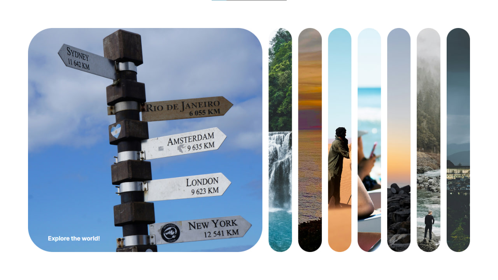

# Day 01: Expanding Panels

## Description
A simple container of panels, which when each panel is clicked/active, it expands wider while the other panels become smaller.

## Technologies Used
- HTML
- CSS
- JavaScript

## How to Run
1. Clone the repository: `git clone https://github.com/yourusername/50-JavaScript-Projects.git`
2. Navigate to the project folder: `cd 50-JavaScript-Projects/Day-01-Clock`
3. Open `index.html` in your browser.

## Screenshot

## Notes
- This project uses vanilla JavaScript for the expansion logic.
- Styles are applied using CSS Flexbox.